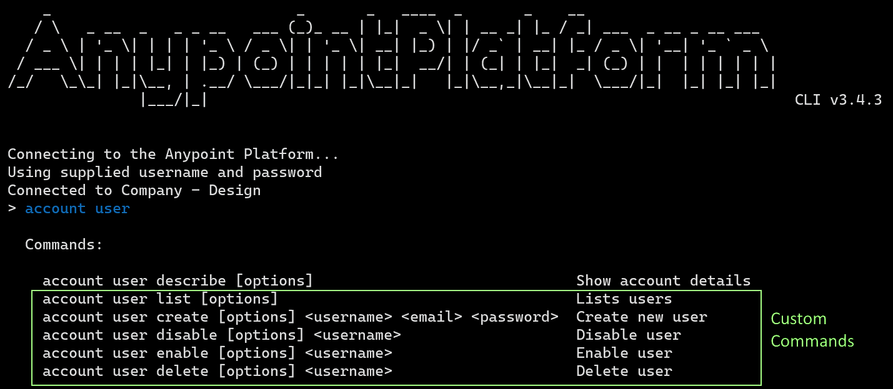

# anypoint-cli-custom-commands
Custom commands for anypoint-cli.  
Seamlessly integration with anypoint-cli.




## Install
Clone or copy this repository to command folder in your installation folder of anypoint-cli.

```
node_modules/anypoint-cli
  - src
    - commands
      - account
      - api-mgr
      - cloudhub
      - anypoint-cli-custom-commands  <-- clone here
      -    :
```

e.g.
- Windows  
`%USERPROFILE%\AppData\Roaming\npm\node_modules\anypoint-cli\src\commands`

- Ubuntu  
`/usr/local/lib/node_modules/anypoint-cli/src/commands`


## Command List

    account user list [options]                                  Lists users
    account user create [options] <username> <email> <password>  Create new user
    account user disable [options] <username>                    Disable user
    account user enable [options] <username>                     Enable user
    account user delete [options] <username>                     Delete user
    account role list [options]                                  Lists roles
